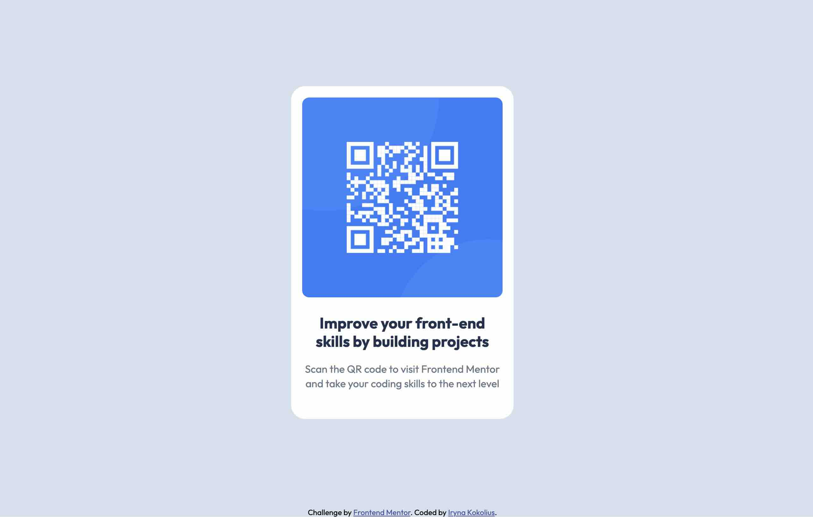

# Frontend Mentor - QR code component solution

This is a solution to the [QR code component challenge on Frontend Mentor](https://www.frontendmentor.io/challenges/qr-code-component-iux_sIO_H). Frontend Mentor challenges help you improve your coding skills by building realistic projects.

## Table of contents

- [Overview](#overview)
  - [Screenshot](#screenshot)
  - [Links](#links)
- [My process](#my-process)
  - [Built with](#built-with)
  - [What I learned](#what-i-learned)
- [Author](#author)
- [Acknowledgments](#acknowledgments)

## Overview

### Screenshot



### Links

- Solution URL: [GitHub Source Code](https://github.com/ikokolius/qr-code-component)
- Live Site URL: [QR Code Component](https://ikokolius.github.io/qr-code-component/)

## My process

### Built with

- CSS custom properties
- Flexbox

### What I learned

I learned centering the card with Flexbox, while maintaining the attribution div on the bottom of the page. The trick is to use auto margin and a wrapper on the card that takes up the available space, allowing justify-content: center; to work correctly.

```html
<body>
  <div class="wrapper">
    <div class="card"></div>
  </div>
  <div class="attribution"></div>
</body>
```

```css
body {
  align-items: center;
  display: flex;
  flex-direction: column;
  min-height: 100vh;
}

.wrapper {
  align-items: center;
  display: flex;
  flex-direction: column;
  flex: 1;
  justify-content: center;
}
.attribution {
  margin-top: auto;
}
```

## Author

- LinkedIn - [Iryna Kokolius](https://linkedin.com/in/iryna-kokolius)

## Acknowledgments

ChatGPT helped me with finding solution on centering my card :-)
