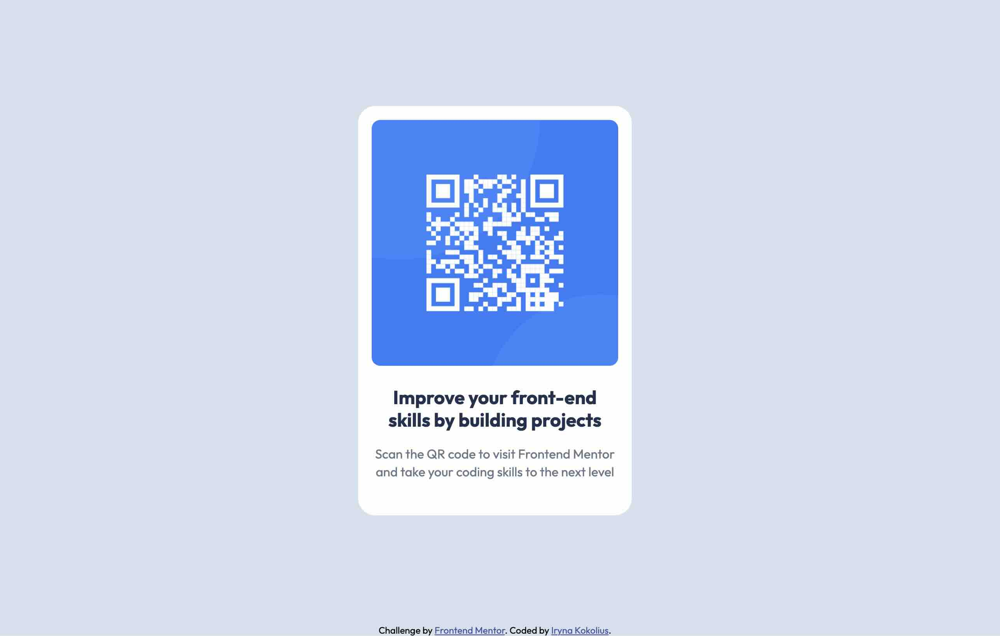

# Frontend Mentor - QR code component solution

This is a solution to the [QR code component challenge on Frontend Mentor](https://www.frontendmentor.io/challenges/qr-code-component-iux_sIO_H). Frontend Mentor challenges help you improve your coding skills by building realistic projects.

## Table of contents

- [Overview](#overview)
  - [Screenshot](#screenshot)
  - [Links](#links)
- [My process](#my-process)
  - [Built with](#built-with)
  - [What I learned](#what-i-learned)
- [Author](#author)
- [Acknowledgments](#acknowledgments)

## Overview

### Screenshot

### Links

- Solution URL: [GitHub Source Code](https://github.com/ikokolius/qr-code-component)
- Live Site URL: [QR Code Component](https://ikokolius.github.io/qr-code-component/)

## My process

### Built with

- CSS custom properties
- Grid

## Author

- LinkedIn - [Iryna Kokolius](https://linkedin.com/in/iryna-kokolius)
